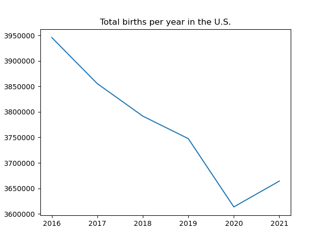

# U.S. Birth Analysis
An in-depth analysis of U.S. births from 2016 to 2021, using JavaScript to create interactive visualizations.
## Group Members
Kat, Mackenzie, Micah, Sergei

# Our Analysis Proccess
## Obtaining the Data
The data we used was pulled from the CDC's WONDER search tool, which provides access to public information from the CDC. The data is gathered through the U.S. birth registration system and does not include births occurring to U.S. citizens or residents outside the United States. The dataset tracks births from 2016 to 2021. 

The dataset can be found [here](https://www.kaggle.com/datasets/danbraswell/temporary-us-births), created by Kaggle user danbraswell.

## Cleaning the Data
The first step we took in cleaning our data was checking for null values and duplicates. We then looked for outliers and ensured that each year included all 51 states (including the District of Columbia). We concluded that the data was consistent, with no missing values or outliers.

## Analyzing the Data
We began by examining the average birth weight of babies and the average age of mothers at birth.

After plotting the data on average birth weight, we concluded that there is a slight decrease in average birth weight over time.

After plotting the data on the average age of mothers, we concluded that the average age of mothers is increasing over time.

We then plotted the number of births in the U.S. by year and concluded that the number of births has been declining over time.

# Contributors
Kat
Mackenzie
Micah
Sergei
# License
