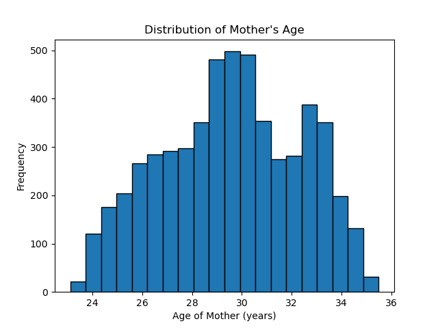

  

# U.S. Birth Analysis
An in-depth analysis of U.S. births from 2016 to 2021, using JavaScript to create interactive visualizations.

# Obtaining the Data
Our data was pulled from Kaggle which was originally sourced from the CDC's WONDER search tool, which provides access to the CDC's public information. The data is gathered through the U.S. birth registration system and does not include births occurring to U.S. citizens or residents outside the United States. Our dataset tracks births from the years 2016 to 2021.

## Overview and Purpose

This project aims to tell a compelling story about US birth demographics using interactive data visualizations. By combining census data with geographical information, we've created a dynamic web application that allows users to explore population trends, birth rates, and other demographic factors across different states, regions, and divisions of the United States.

The purpose of this project is to make complex demographic data more accessible and understandable to users of all levels, from casual browsers to policy makers. By providing interactive visualizations and filtering options, we enable users to discover insights and patterns that might not be apparent from raw data alone.

## Data Sources

- CDC WONDER: https://wonder.cdc.gov/
- Kaggle: https://www.kaggle.com/datasets/danbraswell/temporary-us-births
- US State Divisions & Regions: https://github.com/cphalpert/census-regions/blob/master/us%20census%20bureau%20regions%20and%20divisions.csv

## Data Cleaning Process for US Births Dataset (2016-2021)

### 1. Initial Data Inspection

- Original Data file: `us_births_2016_2021.csv`
- Loaded the dataset using pandas
- Displayed the first few rows with `df.head()`
- Examined basic information about the dataset with `df.info()`

### 2. Descriptive Statistics and Missing Values

- Generated descriptive statistics with `df.describe()`
- Checked for missing values using `df.isnull().sum()`
- Verified the absence of duplicate rows

### 3. Data Structure Analysis

- Examined data types of columns with `df.dtypes`
- Reviewed column names and index structure

### 4. Outlier Detection

- Focused on the 'Average Birth Weight (g)' column
- Used the Interquartile Range (IQR) method to identify outliers
- Calculated upper and lower bounds for outliers
- Counted and reported the number of outliers
- Calculated the percentage of outliers in the dataset

### 5. Detailed Examination of Outliers

- Displayed details of the highest outliers
- Displayed details of the lowest outliers

### 6. Consistency Check

- Verified the completeness of state-year combinations
- Ensured no missing data for any state across all years

## 7. Temporal Consistency

- Plotted total births by year
- Visually inspected for any unexpected patterns or inconsistencies

### Data Cleaning Conclusion

- The dataset was found to be consistent across years and states
- Outliers in Average Birth Weight were within an acceptable range
- No missing state-year combinations were detected
- Total births by year showed a consistent pattern

Based on these findings, the dataset was deemed to pass the data quality checks without requiring further modifications or transformations.

# US Census Data Visualization Project

## Features

- Interactive choropleth map of the United States
- Filtering options by region, division, and state
- Pop-up information cards for each state
- Time series line and barcharts showing specific time series data for selected states
- Responsive design for various screen sizes

## Technologies Used

- Frontend: HTML, CSS, JavaScript
- Mapping: Leaflet.js
- Data Visualization: D3.js
- Backend: Flask (Python)
- Database: PostgreSQL
- Additional Library: Chart.js (for time series visualizations)

## Setup and Installation

1. Clone the repository
2. Install required Python packages: `pip install -r requirements.txt`
3. Set up a PostgreSQL database with schema SQL script `CreateSchema.sql`
4. Load to Update the table with `merged_us_births_data_2016_2021`
5. Run the Data ingestion script: `api_calls.py`
6. Run the HTML file: `index.html`
7. Open `http://localhost:5000` in a web browser

## Specific Packages and Dependencies

- Flask==2.3.2
- flask-cors==3.0.10
- pandas==1.5.3
- numpy==1.24.3
- matplotlib==3.7.1
- seaborn==0.12.2
- SQLAlchemy==2.0.15
- psycopg2==2.9.6
- python-dotenv==1.0.0

## Usage Instructions

1. Use the dropdown menus at the top of the page to filter data by region, division, or state
2. Click on states in the map to view detailed information in the pop-up card
3. When a state is selected, scroll down to view time series charts of birth rates/weights and other demographic factors
4. Use the "Reset Map View" button to return to the initial centered nation-wide view

  

## Ethical Considerations

In developing this project, we made several ethical considerations:

	1.	Data Privacy: We ensured that all data used is aggregated and anonymized, with no personally identifiable information included.
	2.	Accessibility: We designed the interface to be accessible to users with various abilities, including color-blind friendly color schemes and limited keyboard navigation.
	3.	Data Accuracy: We’ve provided clear references to our data sources and information about the origin of the data collection.
	4.	Avoiding Bias: We’ve made efforts to present data objectively, without leading visualizations or commentary that might introduce bias in interpretation.
	5.	Data Validation: We validated our visualizations by pivoting the original data source using Power Query in Excel and checking the results against our index.html visualizations to ensure consistency and accuracy.
	6.	Ethical Use of Data: Our analysis adheres to the ethical principles outlined by the CDC in public health. The birth rates data, sourced from the CDC, is accurate and credible. We prioritize transparency and responsibility by ensuring our conclusions are backed by solid research and trusted sources. Since public health decisions can impact entire communities, we carefully consider the broader implications of our work, aligning with the CDC’s ethical approach to public health actions.

## Additional Python Analysis 

Python analysis explored various aspects of US birth data, including temporal trends, geographical variations, and relationships between variables like maternal age and birth weight. Analyses used various data visualization techniques including line plots, scatter plots, box plots, and heatmaps to effectively present findings. Find the additional python analysis in the `Data_analysis.ipynb` file.

1. **Data Loading and Preparation**
   - Loaded US birth dataset (2016-2021)
   - Used pandas for data manipulation
   - Merged dataset `US State Divisions & Regions` to include regional information `merged_us_births_data_2016_2021.csv`

2. **Time Series Analysis**
   - Analyzed average birth weight trends (2016-2021)
   - Created line plot of average birth weight over time

  

 - Create a line plot time series showing total births over time for the nation

  

3. **Maternal Age Analysis**
   - Examined average maternal age trend and age distribution (2016-2021)

  

   - Plotted line graph of average maternal age over years

   

     
   

4. **Correlation Analysis**
   - Investigated maternal age and birth weight relationship
   - Created scatter plot with regression line

   

     
   

5. **Gender-based Analysis**
   - Created whisker plot of average birth weights by gender

  

6. **Geographical Analysis**
   - Examined birth weight patterns across US Regions

  

   - Developed heatmaps of average birth weights by state and gender
   - Compared birth weights between male and female newborns

  

## US Birth Data Analysis (2016-2021) - Conclusion & Key Findings

### 1. Regional Birth Trends

- The ANOVA test revealed statistically significant differences in birth rates among US regions (F-statistic: 867.3104, p-value: 1.2196e-46).
- This suggests that geographical factors play a crucial role in birth rate variations across the country.

### 2. Regional Growth Rates

- Compound Annual Growth Rate (CAGR) analysis showed varying trends across regions:
  - Some regions experienced positive growth (e.g., Mountain, South Atlantic)
  - Others saw negative growth (e.g., East North Central, Middle Atlantic)
- The overall CAGR for the entire country was negative, indicating a general decline in birth rates from 2016 to 2021.

### 3. Birth Weight Analysis by Gender and State

- Consistent differences in birth weights between males and females were observed across states.
- Male infants generally had higher birth weights compared to female infants.
- The box plot visualization showed:
  - A clear separation between male and female birth weight distributions
  - Slightly larger variability in male birth weights
- Heatmap analysis revealed:
  - Variations in birth weights across states for both genders
  - Some states consistently ranked higher or lower in birth weights for both genders
  - Midwestern states generally had higher birth weights compared to other regions

### 4. State-Level Birth Trends

- A choropleth map visualization highlighted significant variations in average annual births across states.
- The top 10 states with the highest average births were identified, with California, Texas, and New York leading the list.

### 5. Educational and Age Factors

- The analysis included visualizations of birth rates by mother's education level and age, suggesting these factors influence birth trends.
- A positive correlation was observed between mother's age and birth weight.

## CONCLUSION

These findings have important implications for public health policy, healthcare resource allocation, and demographic research. The significant regional and state-level variations in birth rates and birth weights suggest the need for tailored approaches to maternal and infant health care across different parts of the United States.

## Data Sources

- US Census Bureau API: https://www.census.gov/data/developers/data-sets.html
- GeoJSON data for US state boundaries: https://raw.githubusercontent.com/PublicaMundi/MappingAPI/master/data/geojson/us-states.json

## References

- Leaflet.js documentation: https://leafletjs.com/reference.html
- D3.js documentation: https://github.com/d3/d3/wiki
- Chart.js documentation: https://www.chartjs.org/docs/latest/
- Flask documentation: https://flask.palletsprojects.com/
- Javascript documentation: https://developer.mozilla.org/en-US/docs/Web/JavaScript
- Javascript Dropdown Menu: https://www.w3schools.com/howto/howto_js_dropdown.asp
- Javascript Map Container: https://leafletjs.com/examples/quick-start/
- Javascript Popup Card: https://leafletjs.com/examples/popup/
- Javascript Buttons: https://www.w3schools.com/howto/howto_js_accordion.asp
- Javascript Event Listeners: https://www.w3schools.com/js/js_htmldom_eventlistener.asp
- Javascript Styling: https://www.w3schools.com/css/css_website_layout.asp
- Javascript D3 Scales: https://d3js.org/d3-scale
- Javascript Choropleth Map: https://leafletjs.com/examples/choropleth/
- Javascipt Update Map on Mouseover: https://leafletjs.com/examples/choropleth/
- Javascript Update Markers on Click: https://leafletjs.com/examples/marker/
- Javascript Bind Popup: https://leafletjs.com/reference.html#popup
- Javascript Add Layers: https://leafletjs.com/reference.html#map-addlayer
- Javascript Add Chart using Chart.js: https://www.chartjs.org/docs/latest/getting-started/usage.html

## Contributors

- [Micah Springer]
- [Mackenzie Deetz]
- [Kat Chu]
- [Sergei N. Sergeev]

For questions or feedback, please contact [Sergei N. Sergeev] at [sergei.sergeev.n@gmail.com].
